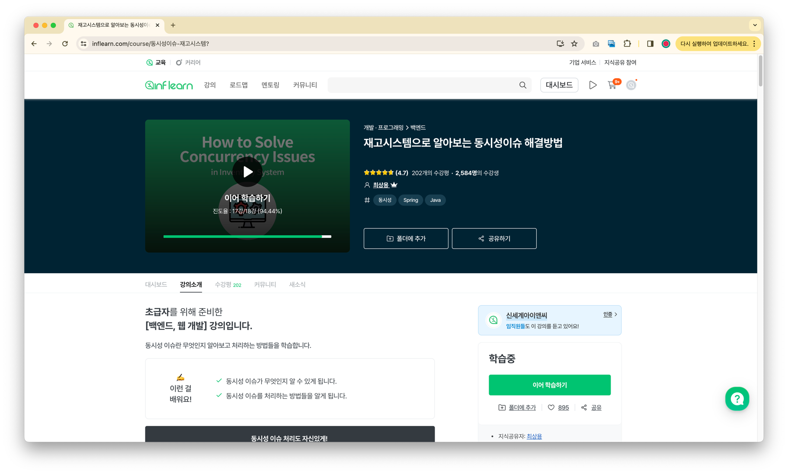
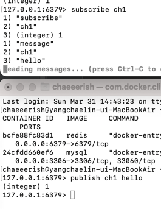

## 재고시스템으로 알아보는 동시성이슈 해결방법
(해당 레포지토리는 [아래의 강의](https://www.inflearn.com/course/%EB%8F%99%EC%8B%9C%EC%84%B1%EC%9D%B4%EC%8A%88-%EC%9E%AC%EA%B3%A0%EC%8B%9C%EC%8A%A4%ED%85%9C?)를 수강한 내용을 기반으로 하였습니다.)


### 학습 목표
- 동시성 이슈가 무엇인가
- 동시성 이슈를 처리하는 방법
  - Application Level
  - Database Lock
  - Redis Distributed Lock

### 문제
쇼핑몰 재고 수량을 update 했는데 원하던 수량이 아니다?

### 데이터베이스 작업환경 세팅하기
- 도커 설치하기
```
brew install docker 
brew link docker
docker version
```
- mysql 설치 및 실행하기
```
docker pull mysql
docker run -d -p 3306:3306 -e MYSQL_ROOT_PASSWORD=1234 --name mysql mysql 
docker ps
```
- mysql 데이터베이스 생성하기
```
docker exec -it mysql bash
mysql -u root -p
create database stock_example;
use stock_example;
```

### Synchroinzed 이용하기
- 예시
```java
@Transactional(propagation = Propagation.REQUIRES_NEW)
public synchronized void decrease(Long id, Long quantity) {
    Stock stock = stockRepository.findById(id).orElseThrow();
    stock.decrease(quantity);
    stockRepository.saveAndFlush(stock);
}
```

- 문제
  - 서버가 1대일 때는 문제가 되지 않지만, 여러 대의 서버를 사용하게 되면 문제가 발생한다.
  - 인스턴스 단위로 thread-safe가 보장되기 때문이다. 여러 서버가 있다면 여러 개의 인스턴스가 있는 것과 동일하기 때문이다.

### Database Lock 이용해보기
1. Pessimistic Lock
   1. 실제로 데이터에 Lock을 걸어서 정합성을 맞춘다.
   2. exclusive lock을 걸게되어 다른 트랜잭션에는 lock이 해제되기 전에 데이터를 가져갈 수 없다.
   3. 데드락이 걸릴 수 있기 때문에 주의해야 한다.
2. Optimistic Lock
   1. 실제로 Lock을 이용하지 않고 버전을 이용함으로써 정합성을 맞춘다.
   2. 데이터를 읽은 후에 update를 수행할 때 내가 읽은 버전이 맞는지 학인한다.
   3. 내가 읽은 버전에서 수정사항이 생겼을 경우 application에서 다시 읽은 후 수행한다.
3. Named Lock
   1. 이름을 가진 metadata locking이다.
   2. 이름을 가진 lock을 획득한 후 해제할 때까지 다른 세션은 이 lock을 획득할 수 없도록 한다.
   3. 트랜잭션이 종료될 때 lock이 자동으로 해제되지 않는다. 별도의 명령어를 수행하거나 선점 시간이 지나야 해제된다.

### Redis 이용해보기
(두가지 라이브러리)
- Lettuce
  - setnx 명령어를 활용하여 분산락 구현
  - spin lock 방식이다.
    - 동시에 많은 스레드가 lock 획득 대기 상태라면 redis에 부하가 갈 수 있다.
  - 락 획득에 실패하면 일정시간 후에 재시도 한다.
  - 구현이 간단하다. 별도의 라이브러리를 사용하지 않아도 된다.
- Redission
  - pub-sub 기반으로 Lock 구현 제공
  - Lettuce와 다르게 별도의 retry 로직을 작성하지 않아도 된다.
  - Thread 1이 락을 release 한다고 Thread 2에게 알려준다.
  - 계속 락 획득을 시도하지 않고, 락 해제가 되었을 때 한 번 혹은 몇 번만 실행하기 때문에 redis의 부하를 줄여준다.
  - 락 획득 재시도를 기본으로 제공한다.
  - lock을 라이브러리 차원에서 제공해주기 때문에 사용법을 공부해야 한다.

**(실무에서는) 재시도가 필요하지 않은 lock은 lettuce를 활용하고, 재시도가 필요한 경우에는 redission을 활용한다.**

- Redis-cli
```
127.0.0.1:6379> setnx 1 lock
(integer) 1
127.0.0.1:6379> setnx 1 lock # 이미 차지되었기 때문에 락 할 수 없다.
(integer) 0
127.0.0.1:6379> del 1
(integer) 1
127.0.0.1:6379> setnx 1 lock
(integer) 1
127.0.0.1:6379> del 1
(integer) 1
```



### MySQL vs Redis
- MySQL
  - 별도의 비용이 들지 않는다.
  - 성능이 Redis 만큼은 아니지만 어느정도의 트래픽까지는 문제가 없다.
- Redis
  - 활용중인 Redis가 없다면 별도의 구축비용과 인프라 관리비용이 발생한다.
  - Mysql보다 성능이 좋기 때문에 더 많은 요청을 처리할 수 있다.
  - 많은 트래픽이라면 도입해야 한다.