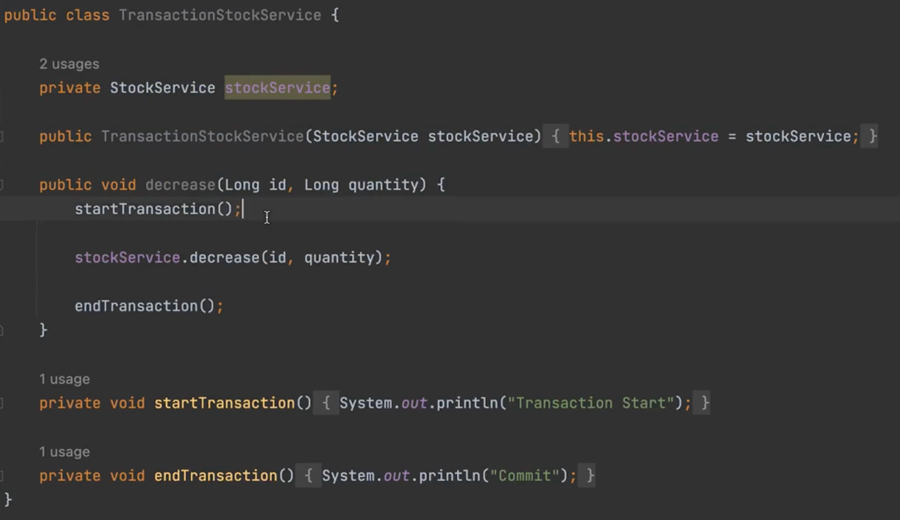
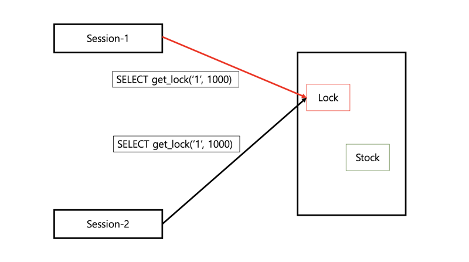

## 재고시스템으로 알아보는 동시성이슈 해결방법
(해당 레포지토리는 [아래의 강의](https://www.inflearn.com/course/%EB%8F%99%EC%8B%9C%EC%84%B1%EC%9D%B4%EC%8A%88-%EC%9E%AC%EA%B3%A0%EC%8B%9C%EC%8A%A4%ED%85%9C?)를 수강한 내용을 기반으로 하였습니다.)


### 학습 목표
- 동시성 이슈가 무엇인가
- 동시성 이슈를 처리하는 방법
  - Application Level
  - Database Lock
  - Redis Distributed Lock

### 문제
**쇼핑몰 재고 수량을 update 했는데 원하던 수량이 아니다?**

### 데이터베이스 작업환경 세팅하기
- 도커 설치하기
```
brew install docker 
brew link docker
docker version
```
- mysql 설치 및 실행하기
```
docker pull mysql
docker run -d -p 3306:3306 -e MYSQL_ROOT_PASSWORD=1234 --name mysql mysql 
docker ps
```
- mysql 데이터베이스 생성하기
```
docker exec -it mysql bash
mysql -u root -p
create database stock_example;
use stock_example;
```

### 기본 프로젝트 - Transactional 어노테이션 사용
StockService.java
```java
@Transactional
public void decrease(Long id, Long quantity) {
    Stock stock = stockRepository.findById(id).orElseThrow();
    stock.decrease(quantity);
    stockRepository.saveAndFlush(stock);
}
```

### 위의 로직의 문제점
- 요청이 동시에 여러 개가 들어오면 재고의 개수가 맞지 않는다.
- 멀티스레드를 이용하여 테스트 케이스를 작성한다.
StockServiceTest.java
```java
@Test
public void 동시에_100개의_요청() throws InterruptedException {
    int threadCount = 100; // 생성할 스레드 개수
    ExecutorService executorService = Executors.newFixedThreadPool(32); // 최대 32개의 스레드를 가질 수 있는 스레드 풀, 동시에 실행할 수 있는 스레드의 최대 개수를 제한한다
    CountDownLatch latch = new CountDownLatch(threadCount); // 특정 횟수만큼의 작업이 완료될 때까지 대기하는데 사용된다

    for (int i = 0; i < threadCount; i++) {
        executorService.submit(() -> { // 작업을 제출한다
            try {
                stockService.decrease(1L, 1L);
            } finally {
                latch.countDown(); // 작업이 완료되었음을 알린다
            } 
        });
    }

    latch.await();

    Stock stock = stockRepository.findById(1L).orElseThrow();
    assertEquals(0, stock.getQuantity());
}
```

- 문제가 발생한 이유는 Race Condition이 일어났기 때문이다.
> 레이스 컨디션이란 둘 이상의 Thread 공유 데이터에 액세스 할 수 있고, 동시에 변경을 하려고 할 때 발생하는 문제이다.  
> 갱신 전의 재고를 가져가서 갱신하기 때문이다.

### 해결 방법1) Synchroinzed 이용하기
- 자바에서 지원하는 방식이다.
- 해당 메소드는 한 개의 스레드만 접근할 수 있게 된다.
```java
@Transactional
public synchronized void decrease(Long id, Long quantity) {
    Stock stock = stockRepository.findById(id).orElseThrow();
    stock.decrease(quantity);
    stockRepository.saveAndFlush(stock);
}
```

- 테스트 실패 원인
  - **Transactional 어노테이션의 동작 방식 때문이다.**
    - 우리가 래핑한 클래스를 새로 만들어서 실행하게 된다.
    - stockService를 가지는 클래스를 새로 만든다.
    - 트랜잭션 시작 ➡️ 메소드 호출 ➡️ 트랜잭션 종료
    - 
    - 하지만, 트랜잭션 종료 시점에 데이터베이스를 업데이트 한다. 
    - 따라서, 실제 데이터가 업데이트되기 전에 다른 스레드가 decrease 메소드를 호출할 수 있다.
  - Transactional 어노테이션을 삭제하면, 해결이 된다.

- **java의 synchronized 문제점**
  - 서버가 1대일 때는 문제가 되지 않지만, **여러 대의 서버를 사용하게 되면 문제가 발생한다.**
  - 인스턴스 단위로 thread-safe가 보장되기 때문이다. 여러 서버가 있다면 여러 개의 인스턴스가 있는 것과 동일하기 때문이다.
  - 실제 운영 서버는 대부분 2개 이상이기 때문에 _synchronized를 잘 사용하지 않는다._

### 해결 방법2) Database Lock 이용해보기
1. Pessimistic Lock
   1. 실제로 데이터에 Lock을 걸어서 정합성(Consistency, 데이터가 서로 모순 없이 일관되게 일치해야 함)을 맞춘다.
   2. exclusive lock을 걸게되어 다른 트랜잭션에는 lock이 해제되기 전에 데이터를 가져갈 수 없다.
   3. 데드락이 걸릴 수 있기 때문에 주의해야 한다.
2. Optimistic Lock
   1. 실제로 Lock을 이용하지 않고 **버전**을 이용함으로써 정합성을 맞춘다.
   2. 데이터를 읽은 후에 update를 수행할 때 **내가 읽은 버전이 맞는지 학인한다.**
   3. 내가 읽은 버전에서 수정사항이 생겼을 경우 application에서 다시 읽은 후 수행한다.
3. Named Lock
   1. **이름을 가진** metadata locking이다.
   2. 이름을 가진 lock을 획득한 후 해제할 때까지 다른 세션은 이 lock을 획득할 수 없도록 한다.
   3. 트랜잭션이 종료될 때 lock이 자동으로 해제되지 않는다. 별도의 명령어를 수행하거나 선점 시간이 지나야 해제된다.
   4. low나 table 단위가 아니라 metadata를 locking한다.

### Pessimistic Lock 구현하기
StockRepository.java
```java
@Lock(LockModeType.PESSIMISTIC_WRITE)
@Query("select s from Stock s where s.id = :id")
Stock findByIdWithPessimisticLock(Long id);
```
별도의 락을 잡기 때문에 성능 감소가 있을 수 있다.

### Optimistic Lock 구현하기
Stock.java
```java
// 버전 컬럼을 추가해야 한다.
@Version
private Long version;
```

StockRepository.java
```java
@Lock(LockModeType.OPTIMISTIC)
@Query("select s from Stock s where s.id = :id")
Stock findByIdWithOptimisticLock(Long id);
```

OptimisticLockFacade.java
```java
public void decrease(Long id, Long quantity) throws InterruptedException {
    while (true) { // 업데이트를 실패했을 때 재시도를 하기 위해서 무한 루프를 사용한다.
        try {
            optimisticLockStockService.decrease(id, quantity);

            break;
        } catch (Exception e) { // 실패하면 50ms 이후에 다시 재시도를 한다.
            Thread.sleep(50);
        }
    }
}
```

업데이트를 실패했을 때 재시도 로직을 개발자가 직접 작성해주어야 한다.  
충돌이 빈번하게 일어나거나 일어날 것으로 예상된다면 적합하지 않다.

### Named Lock 구현하기
- 이름을 가진 락을 획득한 이후에 해제할 때까지 이 이름을 가진 락을 획득할 수 없게 된다.  
- stock 테이블에 락을 거는 것이 아니라 별도의 공간에 lock을 건다.
- 데이터 소스를 분리하는 것이 좋다.
  - lock 획득에 필요한 connection 1개, transaction에 필요한 connection 1개


([사진출처](https://m.blog.naver.com/fbfbf1/222979238425))  

LockRepository.java
```java
// 락을 획득하고 릴리즈하는 레포지토리이다.
public interface LockRepository extends JpaRepository<Stock, Long> {
    @Query(value = "select get_lock(:key, 3000)", nativeQuery = true)
    void getLock(String key);

    @Query(value = "select release_lock(:key)", nativeQuery = true)
    void releaseLock(String key);
}
```

NamedLockStockFacade.java
```java
@Transactional(propagation = Propagation.REQUIRES_NEW) // 부모의 트랜잭션과 별도로 실행되게 하기 위해서 Propagation을 설정해준다.
public void decrease(Long id, Long quantity) {
    try {
        lockRepository.getLock(id.toString()); // 1. 락 획득
        stockService.decrease(id, quantity); // 2. 재고 감소
    } finally {
        lockRepository.releaseLock(id.toString()); // 3. 락 해제
    }
}
```

> **cf. propagation**  
> @Transactional 사용시에 기본적으로 해당 어노테이션이 걸려있는 메소드나 클래스는 트랜잭션의 성질을 띄게 된다. 그 하위에 또 @Transactional 어노테이션이 걸려있다면, 그 상위의 트랜잭션에 포함되어 움직인다. 이를 제어하는게 @Transactional의 옵션 중에 하나인 propagation이다.  
> REQUIRES_NEW 옵션은 부모 트랜잭션을 무시하고 무조건 새로운 트랜잭션이 생성되는 것이다.   
> Default 값인 REQUIRED 옵션은 부모 트랜잭션 내에서 실행하며 부모 트랜잭션이 없을 경우 새로운 트랜잭션을 생성한다.  
> ([참고 블로그](https://m.blog.naver.com/anstnsp/222229118785))

### 해결 방법3) Redis 이용해보기
(두가지 라이브러리)
- Lettuce
  - setnx 명령어를 활용하여 분산락 구현
  - spin lock 방식이다.
    - retry 로직을 개발자가 작성해야한다.
    - **동시에 많은 스레드가 lock 획득 대기 상태라면 redis에 부하가 갈 수 있다.**
  - 락 획득에 실패하면 일정시간 후에 재시도 한다.
  - 구현이 간단하다. 별도의 라이브러리를 사용하지 않아도 된다.
  - **Spring Data Redis의 기본 라이브러리는 Lettuce 방식이다.**
- Redission
  - pub-sub 기반으로 Lock 구현 제공
    - 채널을 하나 만들고, 락을 점유중인 스레드가 락 획득하려고 기다리는 스레드에게 해제를 안내한다.`
    - 따라서, Lettuce와 다르게 별도의 retry 로직을 작성하지 않아도 된다.
    - 예시) Thread 1이 락을 release 한다고 Thread 2에게 알려준다.
  - 계속 락 획득을 시도하지 않고, **락 해제가 되었을 때 한 번 혹은 몇 번만 실행하기 때문에 redis의 부하를 줄여준다.**
  - 락 획득 재시도를 기본으로 제공한다.
  - _lock을 라이브러리 차원에서 제공해주기 때문에 사용법을 공부해야 한다._

> **cf. spin lock**  
> lock을 획득하려는 스레드가 lock을 사용할 수 있는지 반복적으로 확인하면서 lock 획득을 시도하는 방법이다.

**(실무에서는) 재시도가 필요하지 않은 lock은 lettuce를 활용하고, 재시도가 필요한 경우에는 redission을 활용한다.**  
lettuces는 계속 락 획득을 시도하고, redission은 락 해제가 되었을 때 한 번 혹은 몇 번만 시도하기 때문이다.

### Redis 적용하기
- Redis 의존성 build.gradle에 추가
```
implementation 'org.springframework.boot:spring-boot-starter-data-redis'
```
- Redis-cli 접속하기
```
docker run --name myredis -d -p 6379:6379 redis
```

- Redis-cli 명령어
```
127.0.0.1:6379> setnx 1 lock
(integer) 1
127.0.0.1:6379> setnx 1 lock # 이미 차지되었기 때문에 락 할 수 없다.
(integer) 0
127.0.0.1:6379> del 1
(integer) 1
127.0.0.1:6379> setnx 1 lock
(integer) 1
127.0.0.1:6379> del 1
(integer) 1
```


### Lettuce를 적용하기
- MySQL의 NamedLock과 비슷하다.
- 세션 관리에 신경쓰지 않아도 된다.

RedisLockRepository.java
```java
@Component
public class RedisLockRepository {
    private RedisTemplate<String, String> redisTemplate;

    public RedisLockRepository(RedisTemplate<String, String> redisTemplate) {
        this.redisTemplate = redisTemplate;
    }

    public Boolean lock(Long key) {
        return redisTemplate
                .opsForValue()
                .setIfAbsent(generateKey(key), "lock", Duration.ofMillis(3000)); // key에는 stock id, value에는 "lock"
    }

    public Boolean unlock(Long key) {
        return redisTemplate.delete(generateKey(key));
    }

    private String generateKey(Long key) {
        return key.toString();
    }
}
```

LettuceLockStockFacade.java
```java
@Component
public class LettuceLockStockFacade {
    private final RedisLockRepository redisLockRepository;
    private final StockService stockService;

    public LettuceLockStockFacade(RedisLockRepository redisLockRepository, StockService stockService) {
        this.redisLockRepository = redisLockRepository;
        this.stockService = stockService;
    }

    public void decrease(Long id, Long quantity) throws InterruptedException {
        while (!redisLockRepository.lock(id)) { // 락 획득을 시도한다.
            Thread.sleep(100); // 실패하였다면, 100ms의 텀을 주고 재시도한다.
        }

        try {
            stockService.decrease(id, quantity); // 락 획득에 성공하면, 재고 감소를 한다.
        } finally {
            redisLockRepository.unlock(id); // 모든 로직의 종료 후 락을 해제한다.
        }
    }
}
```

### Redisson 이용하기
- build.gradle에 추가하기
```
implementation 'org.redisson:redisson-spring-boot-starter:3.27.2'
```

- 터미널 두 개를 생성한다.
  - 첫 번째 터미널
    - ch1 채널을 구독한다. `subscribe ch1`
  - 두 번째 터미널
    - publish 명령어를 통해서 ch1 채널에 메시지를 보낸다. `publish ch1 hello`
 
- 레디슨은 락 관련된 클래스들을 라이브러리에서 제공해주므로 별도의 레포지토리를 작성하지 않아도 된다.
- 로직 실행 전후로 락 획득 해제를 하는 파사드 클래스를 만든다.
RedissonLockFacade.java
```java
public void decrease(Long id, Long quantity) {
    RLock lock = redissonClient.getLock(id.toString()); // 락 개체를 가지고 온다.

    try {
        boolean available = lock.tryLock(10, 1, TimeUnit.SECONDS); // 10초 동안 락 획득을 시도하고 1초 동안 정지한다.
        if (!available) {
            System.out.println("lock 획득 실패");
            return;
        }

        stockService.decrease(id, quantity); // 락을 획득했다면 재고를 감소시킨다.
    } catch (InterruptedException e) {
        throw new RuntimeException(e);
    } finally {
        lock.unlock(); // 락을 해제한다.
    }
}
```

### MySQL vs Redis
- MySQL
  - 별도의 비용이 들지 않는다.
  - 성능이 Redis 만큼은 아니지만 어느정도의 트래픽까지는 문제가 없다.
- Redis
  - 활용중인 Redis가 없다면 별도의 구축비용과 인프라 관리비용이 발생한다.
  - Mysql보다 성능이 좋기 때문에 더 많은 요청을 처리할 수 있다.
  - 많은 트래픽이라면 도입해야 한다.